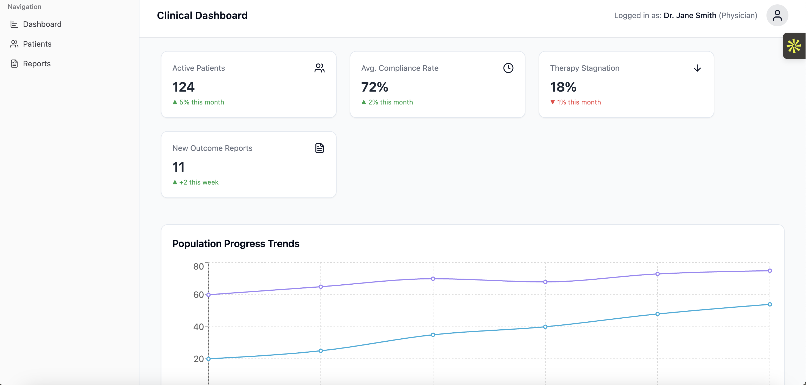

# 🩺 Clinical Dashboard & Physician-Facing Web Interface

## 📋 Overview

A full-stack clinical intelligence platform built to support **clinicians and researchers** in tracking patient recovery, surfacing insights, and improving therapy outcomes.

This project features:

- A **React + TypeScript** frontend with intuitive dashboards and data visualizations.
- A **Strapi-based backend** powering secure API endpoints and structured clinical content.
- **Role-based access** and **HIPAA-aligned** features for managing sensitive health data.
- Exportable reports to support **research workflows** and **regulatory compliance**.

---

## 🚀 Tech Stack

| Layer     | Technology               |
|-----------|---------------------------|
| Frontend  | React, TypeScript         |
| Styling   | Tailwind CSS, shadcn/ui   |
| Backend   | Strapi (Node.js Headless CMS) |
| Build Tool| Vite                      |
| Database  | PostgreSQL (via Strapi)   |

---

## 🛠️ Features

- **Patient Monitoring:** Track individual recovery progress and compliance metrics.
- **Population Trends:** Aggregate clinical data for population-level insights.
- **Dynamic Dashboards:** Automatically adjust views based on user roles (Admin, Physician, Research).
- **Exportable Reports:** Download patient or group-level data for research and regulatory use.
- **Secure Access Control:** Role-based authentication with Strapi-admin interface.
- **CMS Integration:** Easily manage therapies, outcomes, and user data.

---

## 📸 Screenshots

> Replace these paths with actual screenshots or app demos.

- ### 🖼️ Patient Progress View  
  

- ### 🖼️ Population Insights Dashboard  
  

- ### 🖼️ Exportable Reports UI  
  

